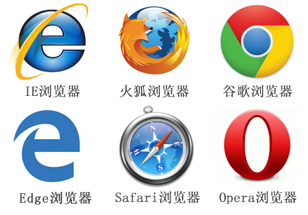
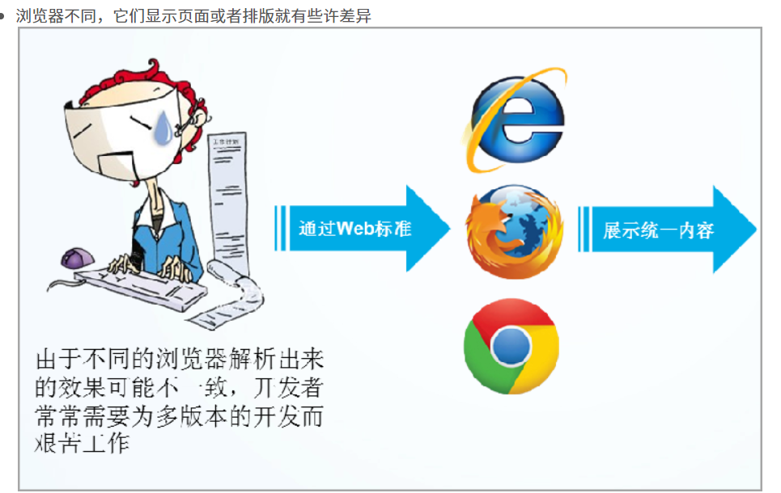
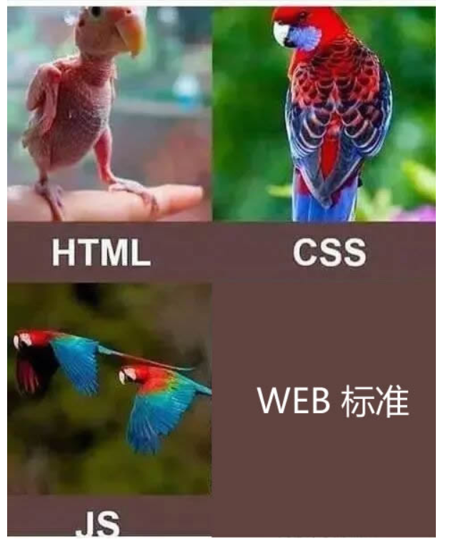
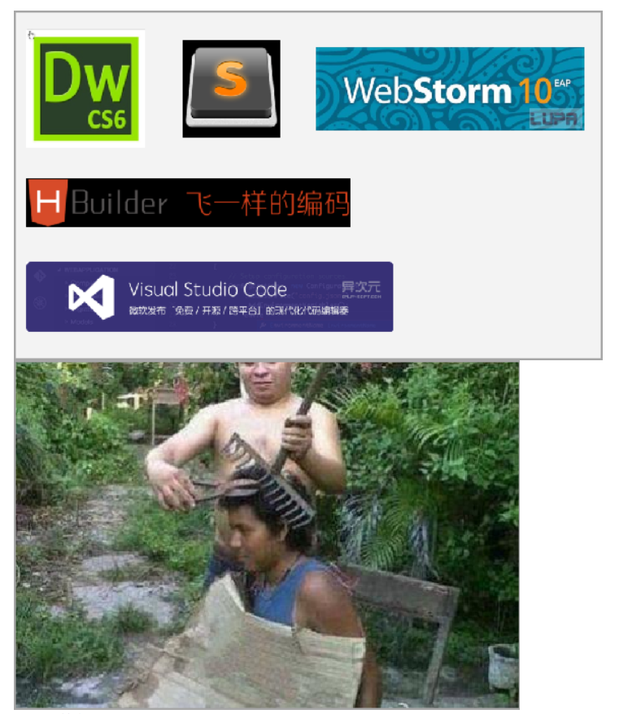
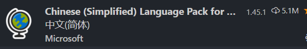
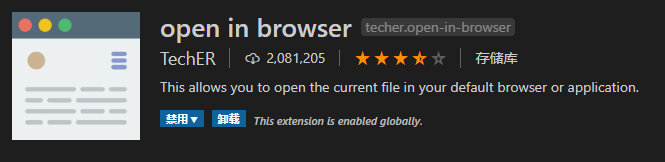
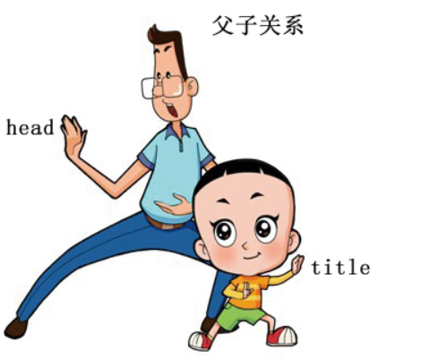
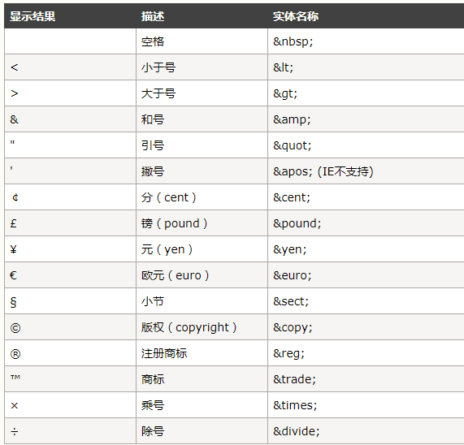

# 【HTML+CSS】day01


## 学习目标

- [ ] 能够说出什么是HTML
- [ ] 能够说出常用浏览器
- [ ] 能够说出Web标准组成
- [ ] 能够写出HTML的基本格式
- [ ] 能够说出HTML的标签之间的关系
- [ ] 能够写出HTML的常用的标签
- [ ] h1 - h6  br   hr   p   strong    b    em i     ins    u     del   s     div   span    
- [ ] img   src   title    alt   width   height
- [ ] a   href  


## 一、认识前端

#### 		前端历史

UI：作图、做成简单HTML页面

前端：html+css+js,   vue/react/Ag

后端：java/PHP/Python/C#/javascript js   NodeJs（服务器程序）

网页：信息展示


#### 		前端发展 及其就业

1. 网页网站开发
2. 后台管理系统
3. 网页游戏开发
4. 移动端页面开发
5. 微信小程序、公众号、订阅号
6. 微信小游戏
7. APP 混合式开发     


## 二、认识网页

### 网页组成

```html
网页是由: 文字,图片,输入框,按钮,视频,音频....元素组成的
总结:
	 网页就是由HTML组成的
```

### 网页规范(万维网联盟W3C)

```html
  ☞ 结构标准:  制作网页必须按照HTMl的标准结构去写网页
  ☞ 表现标准:  用来美化网页CSS
  ☞ 行为标准:  用来实现网页中的用户的一些动作处理 JavaScript
```

## 三、浏览器介绍

### 主流浏览器（有自己的内核）



查看网站：http://tongji.baidu.com/data/browser

### 内核（渲染引擎）

```html
Trident(IE内核)： 
	IE、傲游、世界之窗浏览器、Avant、腾讯TT、猎豹安全浏览器、360极速浏览器、百度浏览器等

Gecko(firefox)：
     Gecko(Firefox 内核)： Mozilla FireFox(火狐浏览器) 采用该内核，Gecko 的特点是代码完全公开，因此，其可开发程度很高

webkit(Safari):
	Safari 是苹果公司开发的浏览器，所用浏览器内核的名称是大名鼎鼎的 WebKit。傲游浏览器3、 Apple Safari (Win/Mac/iPhone/iPad)、Symbian手机浏览器、Android 默认浏览器。

Blink：
	大部分国产浏览器最新版都采用Blink内核。二次开发。谷歌浏览器。Blink 其实是 WebKit 的分支。 

Presto(Opera) ：
	  Presto（已经废弃） 是挪威产浏览器 opera 的 "前任" 内核，为何说是 "前任"，因为最新的 opera 浏览器早已将之抛弃从而投入到了谷歌怀抱了。  
```

##  四、为什么要遵循WEB标准呢？

 通过以上浏览器的内核不同，我们知道他们渲染或者排版的模式就有些许差异，显示就会有差别。导致用户在不同的浏览器看到同一个页面是不同的效果。



## 五、Web 标准构成

**构成：** 主要包括结构（Structure）HTML、表现（Presentation）CSS和行为（Behavior）js三个方面。



- 结构标准：结构用于对网页元素进行整理和分类，咱们主要学的是HTML。 对于网页来说最重要的一部分

- 表现标准：表现用于设置网页元素的版式、颜色、大小等外观样式，主要指的是CSS
- 行为标准：行为是指网页模型的定义及交互的编写，咱们主要学的是 Javascript   js
- 重要的原则：页面三层分离(HTML,css，js书写的时候分开来写)

 理想状态我们的源码： .HTML      .css      .js   


## 六、HTML(重点)

### 6.1、概念

```html
☞ HTML：  Hyper Text  Markup  Language.[  超文本标记语言 ]

   超文本: 本质就是一个文本[在网页中,用来实现页面跳转的文本  ---超链接标签]

   标记: 记号. [各种HTML标签]    标签

HTML的学习其实就是学些大量的标签


标签学习：
1. 标签长什么样子
2.作用

```


#### 标签的语法

```html
标签： <标签名></标签名>

标签语法2： <标签名>
```

### 6.2、结构

注意:
 	1. 我们在以后写代码(html,css,js...)遇到特殊符号,必须都是英文输入下的符号.
 	2. 制作一个网页必须按照html的结构去写.

```html
<!doctype  html>
<html>
    <head>
         <title></title>
    </head> 
    <body>
    </body>
</html>
```

### 6.3、编辑器

常见的前端使用的编辑器



vscode下载地址：https://code.visualstudio.com/Download


#### 编辑器的几个插件






#### 编辑器的使用

1. 快速生成HTML基本结构
   1.   !+tab(按下键盘的tab键)    
   2. html:5 + tab
2. 快速补充完整标签：
   1. 标签名+tab


### 6.4、文档类型与字符集

~~~html
<!DOCTYPE html>
~~~

#### `<!DOCTYPE html>`的作用

这句话就是告诉我们使用哪个html版本？  我们使用的是 html 5 的版本。  html有很多版本，那我们应该告诉用户和浏览器我们使用的版本号。

<!DOCTYPE> 标签位于文档的最前面，用于向浏览器说明当前文档使用哪种 HTML 或 XHTML 标准规范，必需在开头处使用<!DOCTYPE>标签为所有的XHTML文档指定XHTML版本和类型，只有这样浏览器才能按指定的文档类型进行解析。
注意：  一些老网站可能用的还是老版本的文档类型比如 XHTML之类的，但是我们学的是HTML5,而且HTML5的文档类型兼容很好(向下兼容的原则)，所以大家放心的使用HTML5的文档类型就好了。
html5以前的文档类型(了解即可，看看就好)：

```html
1.XHTML1.1
	语法：<!DOCTYPE html PUBLIC "-//W3C//DTD XHTML 1.1//EN" "http://www.w3.org/TR/xhtml11/DTD/xhtml11.dtd">
	
2.XHTML 1.0 Frameset
	语法：<!DOCTYPE html PUBLIC "-//W3C//DTD XHTML 1.0 Frameset//EN" "http://www.w3.org/TR/xhtml1/DTD/xhtml1-frameset.dtd">
	
3.XHTML 1.0 Transitional
	语法：<!DOCTYPE html PUBLIC "-//W3C//DTD XHTML 1.0 Transitional//EN" "http://www.w3.org/TR/xhtml1/DTD/xhtml1-transitional.dtd">
4.XHTML 1.0 Strict
	语法：<!DOCTYPE html PUBLIC "-//W3C//DTD XHTML 1.0 Strict//EN" "http://www.w3.org/TR/xhtml1/DTD/xhtml1-strict.dtd">
	
5.HTML 4.01 Frameset
	语法：<!DOCTYPE HTML PUBLIC "-//W3C//DTD HTML 4.01 Transitional//EN" "http://www.w3.org/TR/html4/loose.dtd">
	
6.HTML 4.01 Strict
	语法：<!DOCTYPE HTML PUBLIC "-//W3C//DTD HTML 4.01//EN" "http://www.w3.org/TR/html4/strict.dtd">
	
7.HTML 5
	语法：<!DOCTYPE html>
```

#### DOCTYPE的作用

声明文档的解析类型(document.compatMode)，避免浏览器的怪异模式。

#### document.compatMode：

- BackCompat：怪异模式，浏览器使用自己的怪异模式解析渲染页面。

- CSS1Compat：标准模式，浏览器使用W3C的标准解析渲染页面。

这个属性会被浏览器识别并使用，但是如果你的页面没有DOCTYPE的声明，那么compatMode默认就是BackCompat。

#### 字符集(了解)

```html
<meta charset="UTF-8" />
```


utf-8是目前最常用的字符集编码方式，常用的字符集编码方式还有gbk和gb2312。

gb2312 简单中文  包括6763个汉字---汉语

BIG5   繁体中文 港澳台等用

GBK包含全部中文字符    是GB2312的扩展，加入对繁体字的支持，兼容GB2312

UTF-8则包含全世界所有国家需要用到的字符---相当于英文

```
记住一点，以后我们统统使用UTF-8 字符集, 这样就避免出现字符集不统一而引起乱码的情况了。
```


### 6.6、结构详解

```html
<!doctype  html>     -----> 用来告诉浏览器文档类型, 该标签最好不要去掉.如果将该标签去掉之后,浏览器会出现一只怪异模式[浏览器不确定到底按照哪种渲染方式去渲染显示网页]

<html></html>   -----> 根标签

<head></head>   ----- 设置网页中基本的配置内容(网页的标题,网页中的样式,网页中的js代码效果....)

<title></title> ----> 设置网页标题

<body></body>  ---> 代表的是网页主体[在网页中除去地址栏看到的任何信息都要放到body标签中]
```

### 6.7、标签之间的关系

```html
☞ 嵌套关系:  一个标签包含其他标签 [父元素和子元素]

☞ 并列关系:  标签之间不存在嵌套包含

  例如:  <head></head>  和 <body></body>
```

嵌套关系：



并列关系：


### 6.8、标签写法分类

```html
☞ 双标签: 有开始和结束的标签.

  总结:
	  1. 如果页面中出现嵌套关系,父元素一定是双标签,子元素可以是双标签或者单标签

☞ 单标签: 只有开始没有结束
  总结:
	  1. 单独标签一定不能作为父元素.
```

#### 单标签

```html
☞ 换行标签:  <br>

☞ 横线:  <hr>

☞ 文档类型:  <!doctype  html>  

☞ 注释标签: <!-- 内容 -->     ctrl + /
```

#### 双标签

```html
☞ 双标签：  <head></head>   <body></body>
```

## 七、常用的标签

### 7.1、标题标签

```html
用来设置页面中的内容标题：<h1></h1>  -  <h6></h6>
	注意：
		1.数字越大，标题标签中的默认字体越小
		2.一个页面一般只有一个h1标签，给logo使用
```


### 7.1、段落标签

```html
用来表示文章段落或者一段文本： <p></p>
	注意：独占一行
```


### 7.2、换行标签(认识)

```html
在HTML中，一个段落中的文字会从左到右依次排列，直到浏览器窗口的右端，然后自动换行。如果希望某段文本强制换行显示，就需要使用换行标签

<br />
```

这时如果还像在word中直接敲回车键换行就不起作用了。

### 7.3、水平线标签(认识)

```html
在网页中常常看到一些水平线将段落与段落之间隔开，使得文档结构清晰，层次分明。这些水平线可以通过插入图片实现，也可以简单地通过标签来完成，<hr />就是创建横跨网页水平线的标签。其基本语法格式如下：


<hr />是单标签
```

 在网页中显示默认样式的水平线。	

### 7.4、格式化（修饰）标签[双标签]

```html
☞ 设置文字颜色或者设置文字大小:  <font></font>

	1. 改变文字颜色需要添加color属性   <font color="red">我是红颜色的文字</font>
    2.  改变文字大小需要添加size属性    <font color="orange" size="7">我是红颜色的文字</font>


☞ 设置文字是否加粗:  <strong> </strong> 或者 <b> </b>

☞ 设置文字斜体显示: <em></em> 或者  <i> </i>

☞ 设置文字删除线效果: <del></del>  或者  <s></s>

☞ 设置文字下划线效果: <ins></ins>   或者  <u></u>
```

### 7.5、div span标签(重点)

div  span    是没有语义的     是我们网页布局主要的2个盒子

div 就是  division  的缩写   分割， 分区的意思  其实有很多div 来组合网页。

span, 跨度，跨距；范围    

语法格式：

```html
<div> 这是头部 </div>    <span>今日价格</span>
```


### 7.6、图片标签【多媒体标签】

```html
☞ 图片标签: 
☞ 属性:  
		src:设置要显示的图片路径     .
		width: 设置标签宽度.
		height: 设置标签高度.
	    title:  鼠标悬停到图片上的文字提示.
		alt:   当图片无法正常显示时候的文字提示.
```

### 7.7、路径（重点）

```html
 ☞ 绝对路径:
	 1. 如果路径中包含具体的磁盘目录:   d:/img/1.jpg
	 2. 如果路径中具有具体的网址:    www.baidu.com/img/1.jpg

 ☞ 相对路径: 必须在同一个根目录下.
	1. 如果当前页面和被访问的资源在同一个文件夹中,路径=直接设置文件名称
    2. 如果当前页面在被访问资源的上一级目录中, 路径=文件所在的文件夹名称/文件名
    3. 如果当前页面在被访问资源的下一级目录中,路径=../文件名称
```

### 7.8、超链接(重点)

```html
本质: 就是用来实现页面跳转.
<a  href="目标页面路径"></a>

属性:
	target:设置目标页面打开方式(默认在当前页面中打开_self | _blank 新窗口中打开)
总结:
	如果希望当前页面中所有超链接跳转页面的时候,都在新窗口中打开,那么只需要在head标签中设置 base标签,给base标签设置target属性即可.
```

#### 锚链接

```html
本质: 在当前页面中跳转. 网页中的返回顶部效果
<a href="#"></a>
"#": 返回当前页面开始位置
```


## 八、特殊字符（了解）



