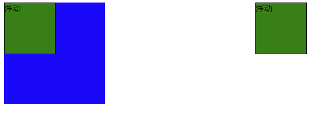

# **【HTML+CSS】day08**


## 学习目标

- [ ] 能够写出前置伪元素和后置伪元素的书写格式
- [ ] 能够说出什么是清除浮动
- [ ] 能够写出清除浮动的几种方法
- [ ] 能够说出html5新增的一些标签

  

## 一、清除浮动

### 1.1、清除浮动的本质

我们之前说到浮动，介绍说同级盒子要么都浮动，要么都不浮动，主要是因为，如果同级下有的盒子浮动，有的盒子不浮动，会造成浮动的盒子影响了不浮动的盒子原来所在位置。简言之，就是浮动会对布局造成影响。

而**清除浮动，清除的是浮动后造成的影响**。

如果按照我们之前说的，同级下所有的盒子都浮动，而父级没有高度，则父级元素会因为子级浮动而使高度变为0(因为子级盒子都 "浮" 起来了)。


如下图：左右盒子的浮动影响了下面没有浮动的蓝色盒子的位置。



```html
<head>
    <meta charset="UTF-8">
    <meta name="viewport" content="width=device-width, initial-scale=1.0">
    <title>浮动造成的影响</title>
    <style>
        .box{
            /*父盒子没有给高度*/
            width: 600px;
            background-color: pink;
        }
        .box .dv{
            width: 100px;
            height: 100px;
            background-color: green;
            border: 1px solid #000;
        }
        .left{
            float: left;
        }
        .right{
            float: right;
        }
        p{
            width: 200px;
            height: 200px;
            background-color: blue;
            margin: 0;
        }
    </style>
</head>
<body>
    <div class="box">
        <div class="dv left">浮动</div>
        <div class="dv right">浮动</div>
    </div>
    <p></p>
</body>
```

###  1.2、清除浮动的方法

方法一：

```css
需求允许的话，考虑给父盒子添加高度
```

方法二：

在所有浮动的盒子后面额外添加一个div标签

```html
<div style="clear: both;"></div>
```

方法三：

```css
给盒子添加父级盒子添加  overflow:hidden 属性
```

方法四：

使用after伪元素清除浮动，:after 方式为空元素额外标签法的升级版，好处是不用单独加标签了 

使用方法：

```css
 .clearfix:after {  content: ""; display: block; height: 0; clear: both; visibility: hidden;  }   

 .clearfix {*zoom: 1;}   /* IE6、7 专有 */

/* 最后给父盒子添加clearfix这个类 */
```

方法五：

使用双伪元素清除浮动

```css
.clearfix:before,.clearfix:after { 
  content:"";
  display:table; 
}
.clearfix:after {
 clear:both;
}
.clearfix {
  *zoom:1;
}
/* 最后给父盒子添加clearfix这个类 */
```


## 二、伪元素

伪元素相当于在一个盒子内部产生一个行内盒子，写伪元素有以下个注意的点：

- ::before和::after前面的双冒号，也可以写为单冒号
- content是必备属性，里面可以填写简单的文字内容
- JavaScript无法操作伪元素
- 伪元素产生时，默认是行内元素，无法指定宽高

### 2.1、前置伪元素

```css
div::before{
    content: "";
    width: 10px;
    height: 10px;
    background: pink;
    display: block;
}
```

### 2.2、后置伪元素

```css
div::after{
    content: "";
    width: 10px;
    height: 10px;
    background: skyblue;
    display: block;
}
```

## 三、html5新标签

html5是新一代的html，提供了很多新的标签。参考网址：https://www.w3school.com.cn/tags/index.asp

```html
<!DOCTYPE html>
<header>头部</header>
<nav>导航</nav>
<section>
    <aside>侧边栏</aside>
    <article>
        <h1>文章标题</h1>
        <p>文章段落1</p>
        <p>文章段落2</p>
        <p>文章段落3</p>
    </article>
</section>
<footer>尾部</footer>
```

## 四、CSS3新属性初步认识

### 4.1、选择器

`:nth-of-type`  和  `:nth-child`  选择器，两者都是选择作为第几个子元素某标签，但是又有区别。

两者区别在于：

`:nth-of-type` 选中的是同类型的第几个，前提在于同类型。

```html
<style type="text/css">
    div p:nth-of-type(2){
        background: pink;
    }
</style>

<div>
    <p>盒子1</p>
    <span>span标签</span>
    <p>盒子2</p>	<!-- 这一个就是变粉色的盒子 -->
    <p>盒子3</p>
    <p>盒子4</p>
    <p>p盒子5</p>
</div>
```

`:nth-child` 选中的是同级中的第几个，前提在于同级。

```html
<style type="text/css">
    div p:nth-child(2){
        background: pink;
    }
</style>

<div>
    <p>盒子1</p>
    <span>span标签</span>
    <p>盒子2</p>	
    <p>盒子3</p>
    <p>盒子4</p>
    <p>p盒子5</p>
</div>
```

由于这里div下同级的第二个元素为span，因此此时不会有任何一个元素变粉色。

**【下一级选择器】**

```css
.father>div{  /*只选择到 .father 标签的第一级子级div标签， 子级的子级不会被选中*/
	...css
}
```

### 4.2、投影属性

```css
box-shadow: x轴偏移 y轴偏移 扩散面积 投影颜色 内外投影;
```

内投影值为inset, 如果是外投影, 直接不写这个值

### 【预习】--4.3、过渡属性

过渡属性 `transition` 是实现css动效的属性。

```css
transition: 属性名称 动画持续时间 运动曲线 延迟时间;
```

我们可以来写一下代码：

```css
div{
    width: 200px;
    height: 200px;
    background: skyblue;
    transition: height 2s linear 1s;
}
div:hover{
    height: 300px;
}
```

如何单独控制transition的某个属性值：

```css
transition-property
transition-duration
transition-timing-function
transition-delay
```

如果我们鼠标移上元素，想要有多个属性，如宽、高和背景都同时改变，显然 `transition-property` 的值，就不能只写一个属性的名称，而该写 `all`，如：

```css
transition: all 2s linear;
```

**补充**

多值写法:

```
transition: height 2s linear, background 1s linear;
```

### 【预习】--4.4、转换属性

转换属性 `transform` 可将元素进行旋转、位移和缩放等转换。

#### 1、旋转Rotate

```css
transform: rotateX() rotateY() rotateZ();
```

值与值之间以空格隔开，单位为deg。

#### 2、位移Translate

```css
transform: translateX() translateY() translateZ();
```

值与值之间以空格隔开，单位为px。

#### 3、缩放Scale

```css
transform: scaleX() scaleY() scaleZ();
```

值为数值，值与值之间以空格隔开，无单位。

#### 4、translate实现未知宽高的盒子居中

https://blog.csdn.net/mr_fzz/article/details/53081452

