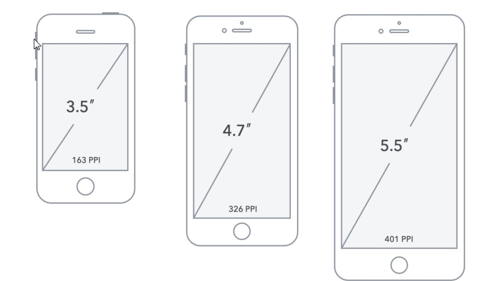
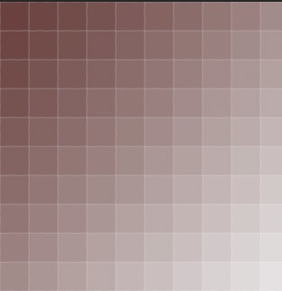

# 【HTML+CSS】day15


## 学习目标

- [ ] 能够说出页面中使用less语法的步骤
- [ ] 能够写出less的变量和嵌套的语法
- [ ] 能够写出less的运算和混合的语法
- [ ] 能够说出你知道的几个长度单位
- [ ] 能够说出%的单位的含义
- [ ] 能够说出em,rem的单位的含义
- [ ] 能够说出弹性布局的几个常用属性
- [ ] 能够利用弹性布局属性写出圣杯布局
- [ ] 能够利用弹性布局属性写出九宫格布局

## 一、less的使用

less是一种css 的预处理语言，简化了css的书写，增强了css的功能，赋予css动态语言的特点，是css的升级版。

说白了，**less就是让我们更好地书写和维护css代码**。

项目中直接引入less代码：

```html
<link rel="stylesheet/less" href="less/styles.less">
<script src="js/less-1.3.3.min.js"></script>
<!-- 注意顺序不能够调换 -->
```

完整代码：

index.html中

```html
<!DOCTYPE html>
<html lang="en" style="font-size: 20px;">
<head>
    <meta charset="UTF-8">
    <meta name="viewport" content="width=device-width, initial-scale=1.0">
    <meta http-equiv="X-UA-Compatible" content="ie=edge">
    <title>Document</title>
    <link rel="stylesheet/less" href="less/styles.less">
    <script src="js/less-1.3.3.min.js"></script>
</head>
<body>
    <div>
    </div>
</body>
</html>
```

styles.less中：

```less
@base-color: red;

/*书写一个宽300px，高200px的盒子(设计图宽度为75)*/
div{
    width: 300px;
    height: 300px;
    background-color: @base-color;
}
```

## 二、less语法

#### 2.1、less变量

```less
//变量的定义
@base-color: pink;

div{
  width: 100%;
  height: 40px;
  background-color: @base-color;
}
button{
  width: 60px;
  height: 30px;
  background-color: @base-color;
}

```

#### 2.2、less嵌套

```less
div{
  width: 100%;
  height: 40px;
  background-color: @base-color;

  //嵌套的写法
  a{
      color:blue;
      &:hover{
        color:red;
      }
  }
}
ul{
    li{
        background: #ccc;
        &.last{
          background-color: pink;
        }
    }
}
```

#### 2.3、less运算

```less
@w:300px;
@color1:green;
@color2:red;

//制作一个高永远是宽度一半的盒子
div{
  //width: @w - 100;//可以
  //width: @w - 200px ;//可以
  width: @w;
  height: @w/2;
  //background-color: @color1 + @color2;  //可以
  //background-color: @color1 + 15; // 可以
  //background-color: @color1 + yellow; // 不可以
}
```

#### 2.4、less混合

```less
@w:300px;
@color1:green;
@color2:red;

.shitihua(@w,@h,@bg){
  width:@w;
  height:@h;
  background:@bg;
}


//制作一个高永远是宽度一半的盒子
div{
  width: @w;
  height: @w/2;
  background-color: @color1 + 15; 

  p{
    .shitihua(100px, 100px, red)
  }
}

span{
  display: block;
  .shitihua(300px, 300px, orange)
}

```


## 三、移动web介绍(了解)

#### 3.1、PC端开发 VS 移动web开发

1）PC端开发

使用的技术：html  css  js 

侧重点：pc端的兼容和适配，pc端的事件（鼠标）


2）移动web

使用的技术：html  css  js 

侧重点：手机端适配，移动端事件（触摸）

#### 3.2、为什么学习移动web

主要是需求决定。用手机端 消费 的人越来越多

例如：

京东双十一销售额(  2015  )


京东双十一销售额 ( 2016 )


## 四、手机屏幕（了解）

移动设备与 PC 设备最大的差异在于屏幕，这主要体现在**屏幕尺寸**和**屏幕分辨率**两个方面。


#### 4.1、屏幕尺寸

通常我们所指的**屏幕尺寸**，实际上指的是屏幕对角线的长度（一般用英寸来度量）如下图所示:( 3.5英寸 ,  4.7英寸,  5.5英寸 )

```
	 iPhone 3 / 4                  	iPhone 6       			     iPhone 6  plus
```



#### 4.2、分辨率

而**分辨率**则一般用**像素来度量 px**，表示**屏幕水平和垂直方向的像素个数**，

例如 ：1920*1080 px 分辨率 

指的是屏幕垂直方向和水平方向分别有 1920 和 1080 个像素点而构成。

如下图所示


#### 4.3、长度单位

在 Web 开发中可以使用 px（像素）、em、rem、pt（点）、in（英寸）、cm（厘米）做为长度单位，我们最常用 px（像素）做为长度单位。

pt(点) ios开发是以点做为单位的，是抽象的单位，是设备的独立像素。

我们可以将上述的几种长度单位划分成**相对长度单位**和**绝对长度单位(in、cm)**。

> iPhone 3G/S 的分辨率是480 * 320 px
>
> iPhone 4/S  的分辨率是960 * 640 px

如上图所示，iPhone3G/S 和 iPhone4/S 的**屏幕尺寸**都为 **3.5 英寸（in）**但是**屏幕分辨率却分别为 480  *  320px、960   *  480px**


#### 4.4、像素密度( PPI )

> 像素密度PPI ：就是屏幕每英寸的像素数量

**DPI**（Dots Per Inch）是印刷行业中用来表示打印机每英寸可以喷的墨汁点数，计算机显示设备从打印机中借鉴了 DPI 的概念。


由于**计算机显示设备**中的最小单位不是墨汁点而是像素，所以用 **PPI**（Pixels Per Inch）值来表示**屏幕每英寸的像素数量**，我们将 **PPI、DPI 都称为像素密度**，但 **PPI** 应用更广泛，

1）计算像素密度

例如下图的像素密度（PPI = 10）

> 下图屏幕的宽为1英寸，1英尺的像素数量为10 px




例如下图的像素密度（PPI = 20）

> 下图屏幕的宽为1英寸，1英尺的像素数量为20 px


2）计算iphone 4手机的像素密度（PPI = 330）


iphone 4手机 是 3.5 英寸。先求出3.5英寸中的像素个数，在除与3.5就是每英寸的像素个数

PPI是每英寸的像素点的个数。


**PPI 值的越大**说明单位尺寸里所能容纳的**像素数量就越多**，所能**展现画面的品质也就越精细**，反之就越粗糙。

**Retina** 即**视网膜屏幕**，苹果注册的命名方式，意指具有较高 PPI（大于 320）的屏幕。


#### 4.5、像素

##### 1）物理像素

**物理像素**，顾名思义，显示屏是由一个个**物理像素**点组成的，通过控制每个像素点的颜色，使屏幕显示出不同的图像，屏幕从工厂出来那天起，它上面的**物理像素点**就固定不变了。

> 1）物理像素大小不是固定的，它与PPI 是有关系。例如：PPI越大，物理像素越小。
>
> 2）物理像素只能获取不能修改


##### 2）css像素(又叫设备像素，设备宽度)

CSS像素是一个抽像的单位，**主要使用在浏览器上**，用来精确度量Web页面上的内容。一般情况之下，CSS像素称为与设备无关的像素(device-independent pixel)，简称DIPs。

**1.PC 端的css像素默认和物理像素保持一致的（1 个单位的 CSS 像素等于 1 个单位的物理像素）**

**2.iPhone3G的css像素默认和物理像素保持一致（1 个单位的 CSS 像素等于1 个单位的物理像素）**

**3.iPhone4/5/6的css像素默认和物理像素不一致（1 个单位的 CSS 像素等于2 个单位的物理像素）**

**4.iPhonex/6/7/8plus的css像素默认和物理像素不一致（1 个单位的 CSS 像素等于3 个单位的物理像素）**


## 五、手机端的适配（重点）

#### 5.1、添加ViewPort视口

视口标签是一个做到移动端页面都会使用到的一个概念。书写能够在移动端上浏览的页面，就需要书写视口标签。

**为什么移动端开发需要视口标签？：**

我们之前所写的页面都是PC端的(电脑端，在电脑上进行浏览)，把它放到移动端浏览器上看，页面会缩小。这是移动端浏览器自动进行缩放页面的效果。而**我们使用视口标签来禁用浏览器的缩放效果**。

**完整的视口标签写法**(不需要背，用到直接CTRL+C)：

```html
<meta name="viewport" content="width=device-width, user-scalable=no, initial-scale=1.0, maximum-scale=1.0, minimum-scale=1.0" />
```

**什么是视口？**

每个网页默认都会有一个**视口**，视口其实是一个**虚拟的窗口** ，**移动端**默认的尺寸是**980**像素;
为了兼容移动设备，一般让**网页视口的宽度和设备的宽度的比例为 1:1 , 并且不允许用户缩放网页**;

**移动设备中1px不等于1个物理像素**（手机屏幕像素）：

现如今，移动设备多已经采用高倍屏，像素分辨率（物理分辨率）要比逻辑分辨率高，下表为iphone分辨率数据

| 型号         | 像素分辨率(手机屏幕分辨率) | 逻辑分辨率 | 倍率 |
| ------------ | -------------------------- | ---------- | ---- |
| iphone5      | 640*1136                   | 320*568    | 2    |
| iphone6      | 750*1334                   | 375*667    | 2    |
| iphone6 plus | 1242*2208                  | 414*736    | 3    |

独立像素比

#### 5.2、布局适配方案

##### flex弹性布局（重点）

弹性布局是一种新的布局方式，它改变了我们书写布局的方式。

**display: flex;    将容器盒子（即父盒子）设置为弹性布局**

**flex属性。flex属性值为正数，如果子级都设置了flex，表示盒子宽度(或高度)占了父盒子的  正数/子级flex总和。**


一般来说，使用`flex-direction`、`align-items`和 `justify-content`三个样式属性就已经能满足大多数布局需求。

**flex-direction控制主轴的方向**

flex-direction的4个值：row，row-reverse，column，column-reverse

'row'  设置主轴为水平正向     123

'row-reverse'  设置主轴为水平反向     321

 'column'  设置主轴为垂直正向    123

 'column-reverse'  设置主轴为垂直反向     321

**justify-content控制主轴的对齐方式**

justify-content的5个值：flex-start，flex-end，center，space-between，space-around

'flex-start': 左(或顶)对齐  默认值

'flex-end' 右(或底)对齐

'center' 居中对齐 

'space-between' 中间留白

'space-around' 中间及两侧留白

**align-items属性控制侧轴对其方式**

align-items属性的5个值：  flex-start，flex-end，center，stretch，baseline

'flex-start': 左(或顶)对齐  默认值

'flex-end' 右(或底)对齐

'center' 居中对齐 

'stretch' 设置侧轴拉伸，此时侧轴方向(宽或者高)不要给固定数值，才能看得见拉伸效果

'baseline' 设置基线对齐，文字底部对齐


flex兼容性：


**flex布局圣杯布局案例：**


```html
<!DOCTYPE html>
<html lang="en">
<head>
    <meta charset="UTF-8">
    <title>03-flex圣杯布局案例.html</title>
    <style>
        *{
            margin: 0;
            padding: 0;
        }
        header{
            height: 44px;
            width: 100%;
            background: skyblue;
            display: flex;/**指定弹性布局*/
            flex-direction: row;/**指定主轴*/
        }

        .left{
            width: 100px;
            height: 100%;
            background: red;
        }

        .center{
            flex:1;/**指定权重*/
            height: 100%;
            background: pink;
        }

        .right{
            width: 100px;
            height: 100%;
            background: red;
        }
    </style>
</head>
<body>


<header>
    <div class="left">left</div>
    <div class="center">center</div>
    <div class="right">right</div>
</header>
</body>
</html>
```

**九宫格布局案例：**

```html
<style>
        *{ margin: 0;padding: 0;list-style: none;}

        ul{
            margin: 100px auto;
            display: flex;
            /*换行*/
            flex-wrap: wrap; 
            width: 300px;
            height: 300px;
            border: 1px solid #000;
        }
        li{
            width: 100px;
            height: 100px;
            background-color: pink;
        }
    </style>
</head>
<body>
    <ul>
        <li>1</li>
        <li>2</li>
        <li>3</li>
        <li>4</li>
        <li>5</li>
        <li>6</li>
        <li>7</li>
        <li>8</li>
        <li>9</li>
    </ul>
```


##### rem布局-（重点）

**1.什么是em?**

> ( Element ) em转成px ：跟自身大小 或者 父亲 字体大小 有关系

  使用em单位时，像素值是em值乘以使用em单位的元素的字体大小( `像素px=em值 * fontSize大小`)

 

案例：如果一个 div 有 18px 字体大小，给标签10em 将等同于 180px，即` 10em × 18px = 180px`


> 根据W3标准 ，em 单位是相对于使用em单位的元素的字体大小( 也是相对于字体大小，有可能是父亲的元素也有可能是自身的元素字体大小 )

```html
<!DOCTYPE html>
<html lang="en">
<head>
    <meta charset="UTF-8">
    <title>Title</title>
    <style>
        header{
            font-size: 18px;
        }
        .div1{

            width: 10em;
            height: 10em;
            background: red;
        }
    </style>
</head>
<body>

<header>
    <div class="div1"></div>
</header>

</body>
</html>
```


**3.什么是rem**

> rem 转成 px ：跟 html 字体大小 有关系

Root Element（REM）是CSS3中新定义的一种长度单位。和em单位相比在使用上具有明显的优势。

Rem转化为像素px大小取决于页根元素html的字体大小，即 html 元素的字体大小

> 使用rem单位时，像素值=是rem值乘以html元素的字体大小( `像素px=rem值 * fontSize大小`)

  

rem的兼容性：

 

 使用案例1：根元素html的字体大小 16px，给标签10rem 将等同于 160px，即 `10rem  x 16px = 160px`


使用案例2：根元素html的字体大小 100px，给标签1rem 将等同于 100px，即 `1rem  x  100px = 100px `


##### vw  vh 布局（相对单位相对于屏幕宽度）

**1.css单位长度值**

| 单位    | 含义                                                 |
| ------- | ---------------------------------------------------- |
| **em**  | 相对于父元素（或自身元素）的字体大小                 |
| **rem** | 相对于根元素（html）字体大小                         |
| **vw**  | 相对于视窗的宽度：视窗宽度是100vw                    |
| **vh**  | 相对于视窗的高度：视窗高度是100vh                    |
| px      | 像素                                                 |
| %       | 相对于父元素。正常情况下是通过属性定义自身或其他元素 |

**2.vw vh 兼容性**

`vw`, `vh`这几个视区相关单位，在2012年9月23号这天的兼容性为：Chrome 20+, IE9+ 以及Safari 6支持！


## 四、在移动页面中使用rem单位(过程了解、记结果)

把浏览器分辨率分成10份，每一份给到html作为字体大小：

```js
var winW = document.documentElement.clientWidth   
var htmlFont = winW/10;
document.getElementsByTagName('html')[0].style.fontSize = htmlFont+'px';
```

现在，在不同的机型下，html的字体大小就不同，即1个rem所表示的像素就不同。所以把元素的宽度、字体大小等属性单位写成rem，就可以动态设置这些属性。在不同的浏览器分辨率下有最好的展示（按照设计图比例）。


问：(前提：把屏幕分成10份)在宽度为750的设计图下，一个元素的宽度是300px，在样式代码里写多少rem?

300px  =  ？Rem  

？=300/75 

width:300/75rem

