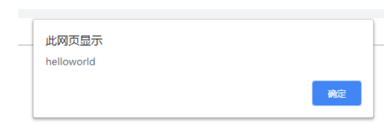
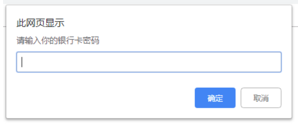
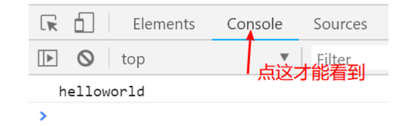
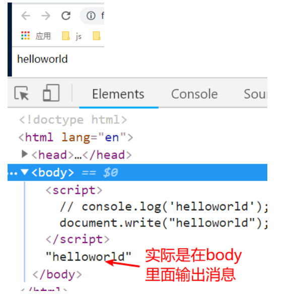
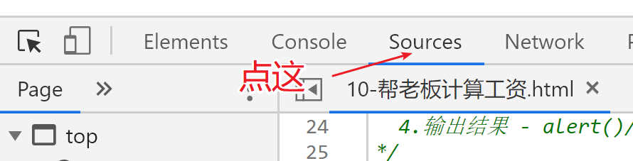
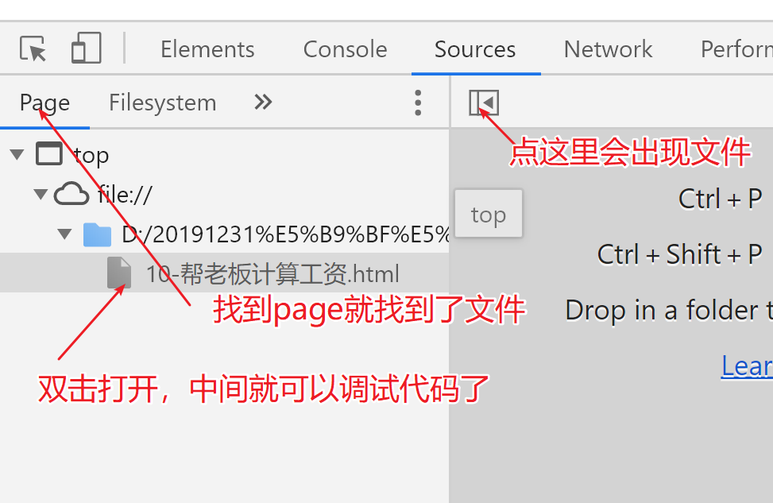
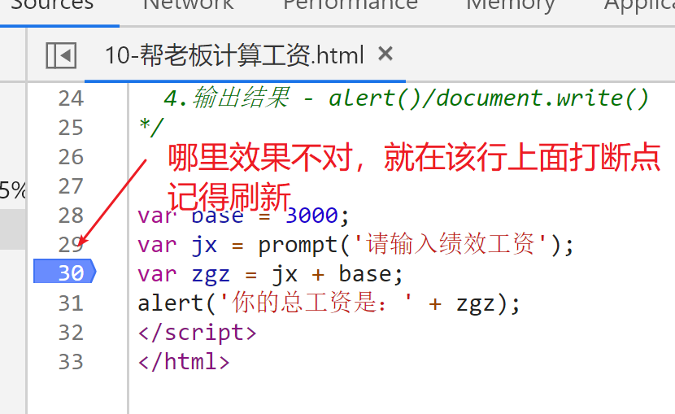
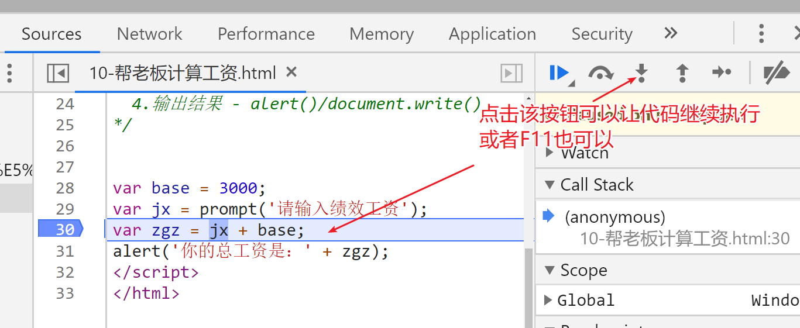
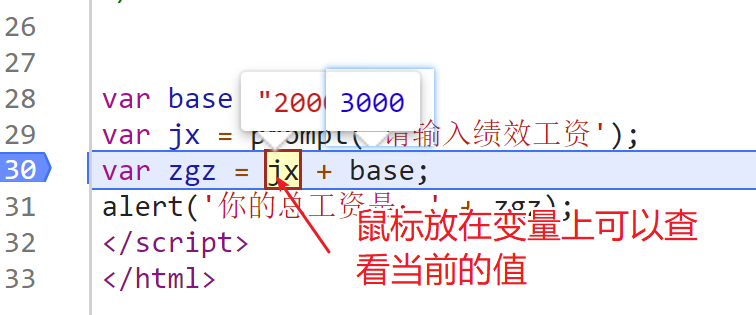

# js基础第01天

> 今天的目标
>
> 1.能说出什么是编程
>
> 2.能认知到JavaScript是一门编程语言
>
> 3.能使用变量存储数据
>
> 4.熟记变量的命名规范
>
> 5.能说出JavaScript的5种简单数据类型


## 1. JavaScript介绍

### 1.1  js的大致的历史

1995年诞生，Netscape 公司，为了让页面可以验证表单，发明了它

同年，微软不甘示弱，也发明了自己的js —— jScript

两大公司相互竞争，导致程序员非常的痛苦，。

后来Netscape把js提交给 ECMA 协会，要求统一标准 —— ECMAScript 这个标准

一直发展，发展出了很多的版本、最早 JavaScript1.1 --> ECMAScript 1.0

有ECMAScript5，ECMAScript6


### 1.2 课外阅读

https://segmentfault.com/a/1190000020697051

https://www.cnblogs.com/dongtianee/p/4492665.html


### 1.3 写在前面的话

​		本阶段的重点为JavaScript这门语言的各种语法，需要重点掌握的是每种语法的写法，用途，而不是用来熟练语法的题目。因为JavaScript这门语法是一门编程语言，需要一定的逻辑思维，所以设置这些题目的意义在于：一来可以熟练大家的语法，二来锻炼大家的逻辑思维。但是思维不是一朝一夕可以形成的，切不可急躁，应该先把简单和语法记熟，再尽量掌握解决题目的方法


### 1.4 为什么要学习JavaScript

我们在之前已经学习了HTML和CSS这两个技术，这两个技术能做的是页面的静态效果，如果想让页面上有一些能动起来的效果，比如轮播图、数据格式验证等，就要用到JavaScript。简而言之：

* HTML - 页面的骨架

* CSS - 页面的外貌

* Javascript - 页面的行为能力

  

### 1.5 什么是JavaScript

> Javascript是一门运行在**浏览器**上的**脚本语言**

​		什么是编程 —— 人为的设定一些步骤，让计算机去执行

​		JavaScript就是一门让我们和浏览器交流沟通的语言，我们在写这门语言的时候，要遵循这门语言的固定语法，使用其特定单词，浏览器才能读懂。浏览器不像人，浏览器是认死理的，不会灵活理解我们所写的代码，所以一定要严格按照JavaScript的语法来写代码

​		那么什么是语法：语法就是我们表达时必须遵守的固定格式。

例如：

​		正常的说法：小明吃了一只鸭子

​		如果我们不按照固定的格式说，可能变成：鸭子吃了一只小明

​		这是一件非常恐怖的事！！！

​		所以——遵循语法非常重要

​		综上所述，我们要学习的，就是JavaScript这门语言的**语法**和里面特有的**单词**

​		JavaScript简称`js`


### 1.6 JavaScript的组成

* ECMAScript - 简称es，用来规范JavaScript的语法的，具有多个版本。
* DOM - 文档对象模型，用来操作页面上的标签的
* BOM - 浏览器对象模型，用来操作浏览器的部分功能的

### 1.7 怎么学js

怎么学？js是一门语言，跟浏览器沟通的语言 —— 语言的组成： 语法+单词

语法：不需要理解，只需要记住，然后熟练运用

单词：先学会读，多写多练。

从思想上进行感悟：

什么是编程？编写程序——有步骤，每个步骤都有为什么——这才是真正重要的东西。


## 2. JavaScript该写在哪里

JavaScript和css一样，也有三种书写方式

### 2.1 内嵌式

在一个固定的标签 —— script , 写js代码

```html
<script>
  alert('邮箱的名字不合理');
</script>
```


### 2.2 外联式

1.在外部准备一个js文件，使用script标签引入

```html
// 语法  <script src="js文件的路径" ></script>

<script src="./01.js"></script>
```


### 2.3 行内式

写在标签的属性里面的，通常都是  onXXX 这些属性里面

```html
<input type="button" value="按钮" onclick="alert('hello world');">
```


> 总结：
>
> 1.使用方式有3中，开发里面外联使用的多，上课多用内嵌，行内几乎不用
>
> 2.建议js都写在其他的结构标签的后面 —— 后面学习的时候再解释
>
> 3.外联式的script里面不要写代码


## 3. 注释语法

js里面的注释分两种

```js
/* 多行注释，用于注释多行 */
/*
  alert('1');
  alert('2');
*/

// 单行注释
// alert('123');
```


> 小结
>
> 多行注释不要嵌套使用


## 4. 四个常用js方法

#### 4.1 alert(xx)

作用： 用于来浏览器弹出一个提示框

~~~js
// 弹窗提示
alert('不好意思，您的账号输入错误！');
~~~

效果：



#### 4.2 prompt()

作用：在浏览器里面弹出一个输入框，让用户输入

~~~js
prompt("请输入你的银行卡密码"); // 同样使用引号包起来
~~~



#### 4.3 console.log(xxx1，xxx2)

作用：这个方法可以在开发者工具的 `Console`选项，也就是我们所说的`控制台`里面输出消息

~~~js
 // 在浏览器控制台窗口显示内容（后期主要用于调试代码）
console.log('测试一下~')
~~~



#### 4.4 document.write()

作用：这是一个比较早期的时候，浏览器里面提供的一个在页面的body标签里面输出消息的方式，现在很少用了

~~~js
//使用js把内容写入页面
document.write('今天天气真好');
~~~

效果：




## 5. 变量

如果我们使用prompt()方法让用户输入了数据，我们又想要把用户输入的数据保存起来，怎么办呢？

在JavaScript中有一种专门用于保存数据的语法：**变量**

### 5.1 什么是变量

变量就是存储数据的容器

### 5.2 变量的语法

用是先定义再使用

### 5.3 变量定义

```javascript
var 变量名 = 数据;
```

使用`var`这个单词，告诉浏览器，我们要定义一个变量，使用`=`号告诉浏览器，我们要把左边的数据存储到变量里面

当我们想使用这个数据的时候，就可以直接使用这个变量代替这个实际数据

```javascript
// example 1
var pwd = prompt('请输入你的很行卡密码');
console.log(pwd);
// example 2
var num1 = 10;
var num2 = 20;
console.log(num1 + num2);//计算两个数字的和
```

变量定义分为两个过程：变量声明和变量赋值

```javascript
// 变量声明
var a;
// 变量赋值
a = 10;
```

变量可以被重新赋值

```javascript
var b = 100;
b = 200;
```

上面代码中，`200`被称为变量`b`的`值` 


### 5.5 变量命名规范

变量的命名规范

1. 能够使用那些字符 ： 数字、字母、下划线、$
2. 不能使用数字开头
3. 不能使用js里面具有特殊功能的单词 —— 关键字,也不建议使用保留字
4. 区分大小写
5. 建议命名有意义
6. 建议使用驼峰命名 - 单词的首字母，第一个单词小写，其他的单词的首字母大写

错误演示

~~~js
// 变量不能使用数字开头
var 15a = 10;
// 会在控制台中报错：Uncaught SyntaxError: Unexpected number
// Uncaught - 未捕获的
// SyntaxError - 语法错误
// Unexpected - 意料之外的
// number - 数字
// 翻译过来就是： 这行有一个语法错误，你的数字不符合语法要求

// 变量名字不能使用关键字
var var = 20;
// 会在控制台中报错： Uncaught SyntaxError: Unexpected token var
// token - 标记，记号，在编程中我们翻译成 '标识符'
// 意思是这行有一个语法错误，出现了一个意料之外的标识符 var

// 变量名字是区分大小写的
var a = 10;
console.log(a);// 正常输出
console.log(A);// 在控制台中报错：Uncaught ReferenceError: A is not defined
// ReferenceError - 引用错误
// not defined - 未定义
// 意思是 A 这个变量我们没有定义就使用了，可见a和A是不一样的，不是同一个变量
~~~

> Tips :
>
> 大家在学习的过程中，会遇到许多错误，要习惯看控制台中的错误代码，也可以自己准备一个错题集，把常见的错误记录下来，以便以后遇到同样的错误的时候可以借鉴以前解决错误的思路


## 练习

交换两个变量的值


## 6. 数据类型

### 简单类型

### 6.1 数值

其实就是数字，就是整数、小数、负数....

```js
var num1 = 123;
```

小数相加可能会有bug

```js
console.log(0.1 + 0.2); // 不是0.3 , 是一个不准确的数字
```

数值类型中 还有一个非常特殊的存在： NaN， 先记住，一会再介绍是什么


### 6.2 字符串

字符串主要作用就是用来表示文本的，单词、字母、汉字、文章、名字...

##### 固定格式

```jade
'字符'
"字符"
```

我们发现，在js的语法中，已经使用了引号来做为格式了，如果我们就是要输出一个引号，不使用特殊的手段是做不到的，如果希望引号里面出现引用

```js
// 1.嵌套引号
console.log('<div id="box"></div>');
// 2 转义字符
console.log("<div id=\"box\"></div>")
```

所谓转义字符，就是在想要转义的字符前面加上一 `\`，这样就把带有特殊意思的字符变成了普通的字符，就可以输出了


### 6.3 布尔

是在编程中专门为了表示条件结果的，只有两个值： true 和 false

true - 表示结果成立，为真

false - 表示结果不成立，为假

```js
var result = 4 > 5;
console.log(result);// false ,因为 4 > 5 不成立
var res = 5 < 6;
console.log(res); // true 因为 5 < 6 成立
```


### 6.4 null和undefined

undefined  —— 未定义 ，一般很少主动使用，知道是未定义的意思就行

通常就是我们声明了变量但是没有赋值，就是undefined

null —— 空 , 什么都没有 ， 通常也是不会主动使用，而是得到的一个结果是null

```js
prompt('输入框'); // 如果点击了取消，就是 null
```


### 6.5 复杂类型

Object —— 后面专门找时间学习


## 7. typeof判断基本类型

我们学习了这么多的数据类型，怎么知道一个数据到底是什么类型呢？js提供了一个可以返回数据类型的关键字：typeof

用法有两种

```javascript
typeof 数据;
typeof(数据);
```

```javascript
console.log(typeof 123);// number
console.log(typeof 'abc');//string
console.log(typeof true); // true
console.log(typeof undefined); // undefined
```

> 回顾
>
> 1.数据是分类型的，JavaScript里面有两种大类型：简单(值)和复杂(引用)
>
> 2.简单类型分为：数字、字符串、布尔、null、undefined
>
> 3.可以使用typeof获取数据的类型

## 练习

我们学习了那多的知识，现在可以做一个程序计算总工资：

​	1.先声明一个变量，先存储着基本工资

2. 通过prompt弹出的输入框，获取老板输入的绩效工资

3. 计算 总工资 = 基本 + 绩效

4. 使用alert() 弹出总工资

~~~js
// 让老板输入绩效工资
var performance = prompt('请输入张三的绩效工资');
var base = 4000;
// 计算总工资
var salary = base + perfomance;
// 展示总工资
alert(salry);
~~~

如果我们输入的绩效工资是：3000

alert()展示的工资将是：40003000

这是不符合事实的！！！原因是我们输入的3000是一个字符串，字符串加上数据得出一个不正确的结果。所以我们要把字符串的3000变成数字的3000 —— 数据类型转换


## 8. 浏览器里面调试代码

第一步： 打开sources选项卡



左边可能会有文件，也可能没有，需要自己把文件点出来



在需要断点的地方打断点(哪里有问题就在哪里打断点)



刷新就会停在断点的行上面



然后就观察，每个变量的当前的值是多少




> 


## 9. 类型转换

在js中，数据类型是可以相互转换的

主要是三大类：转成数字、转成字符串、转成布尔

~~~js
把其他转成数字： Number() 、 parseInt() 、 parseFloat()
把其他转成字符串：String() 、.toString()
把其他转成布尔: Boolean()
~~~


把其他转换为数字

```js
Number(数据) // 把其他的类型转换为数字
parseInt(数据) // 把字符串转换为整数
parseFloat(数据) // 把字符串转换为小数
var result = Number('3000');  // 3000
parseInt('1.22') // 1
parseFloat('1.22') // 1.22
```


其他转字符串

```js
String(数据)
(数据).toString() // 小数和null、undefined在使用的时候要小心

var res1 = String(123);
console.log(res1);  // 输出字符串的 123
console.log(typeof res1); // 输出 string

var res2 = String(true);
console.log(res2); // 输出字符串的 true
console.log(typeof res2); // 输出 string

var res3 = (123).toString();
console.log(res1); // 输出字符串123
console.log(typeof res1); // 输出string

var res4 = undefined.toString();
console.log(res3); // 报错：Cannot read property 'toString' of undefined

var res5 = null.toString();
console.log(res4); //报错： Cannot read property 'toString' of null
```

> 但是转换为字符串是很少用的，了解就行


转换为布尔

```js
Boolean(数据);
只有以下几个是false，其他都是true
console.log(Boolean(0));
console.log(Boolean(''));
console.log(Boolean(null));
console.log(Boolean(undefined));
console.log(Boolean(false));
console.log(Boolean(NaN));
```


## 10. 运算符

### 10.1算术运算符

`+ `操作符的作用有：

1. 字符串相连
2. 数字相加

```jsx
1. 字符串 + 其他 = 字符串
会把其他类型 转换为 字符串 ， 两个字符串连接到一起
2. 数字 + 数字 = 数字
会把其他类型 转换为 数字 ，再相加
```


-`操作符的作用就是数字相减

```js
- 
都是优先把非数字的转换为数字，再运算
var res3 = '456' - 123; 
console.log(res3); // 输出 数字 333
var res4 = 'abc' - 123;
console.log(res4); // 输出NaN
这是因为，数字和字符串在相减的过程中，会把字符串隐式转换成数字，再相减。但是如果字符串在转换的过程中，无法转换成数字，就会转换成NaN，再计算就无法得到一个正确的数字结果
```


`*`操作符的作用是两个数字相乘

`/`操作符的作用是两个数字相除

`%`操作符的作用是两个数字求模(得到余数)

```js
% 
  作用： 得到两个数字相除的余数
  无法整除的部分就是余数
  
  看看一个数字是否整除另一个数字
```

### 隐式转换

隐式转换是指在数据在参与运算的过程中，数据根据操作符的运算规则自动进行的数据类型转换。


### 10.2. 比较运算符

```js
> <  >=  <= 
  以上都是和数学里面的比较是一样的规则

== 
  判断两个值是否相等
console.log(5 % 2 == 0);

!=
  判断两个值不相等
console.log(5 % 2 != 0);

===
  判断类型和值是否相等
console.log(undefined === null);
!==
  判断类型和值是否不相等

console.log(NaN == NaN); // false 
// 如何验证一个数据, 不是NaN
//  isNaN(数据) 判断一个数据是否是NaN
console.log(isNaN(NaN)) //  NaN是一个NaN, 所以得到的是true
console.log(isNaN(123)) //  123不是一个NaN, 所以得到的是false
```


## 作业

1. 今天的语法知识点

   1.1 分别使用三种js引入方式，实现 alert('hello world')

   1.2  js的行注释   和  块注释分别是哪个符号，有什么区别

   1.3  在页面中弹出一个“登录成功”弹窗

   ​		在页面中弹出一个“明天吃什么？”的输入框

   ​		在控制台中输出一句话“代码虐我千万遍，我待代码如初恋”

   ​		在浏览器页面中输出一句话“代码虐我千万遍，我待代码如初恋”

   1.4  定义两个变量，第一个值是1，第二个变量的值“哈哈”，用两种方式实现

   1.5 交换两个变量的数据

   1.6  js中简单的数据类型有哪些

   1.7  使用console.log()  在控制台中输出   ` 狗蛋说: "明天去找翠花玩！"`

   1.8  使用typeof  分别验证  ‘123’ 、123 、 false 的数据类型是哪个

   1.9  使用两种方式，把var num = '123.12'   这个字符串转成数字类型，不能舍去小数点

   1.10 Number()   parseInt()   parseFloat()的区别是什么

    1.11  哪些数据可以转成布尔值false      

   1.12     =   与  ==   与  === 的区别是什么

   

2. 问用户喜欢吃什么水果(fruits),假设用户输入”苹果”,然后在屏幕上显示”哈哈,这么巧,我也喜欢吃苹果”

3. 计算工资，基本工资是3000，问用户绩效工资是多少？弹出弹窗显示用户总工资（总工资=基本工资+绩效工资）

4. 定义四个变量,分别存储一个人的姓名、性别(Gender)、年龄、电话(TelephoneNumber)。然后打印在屏幕上 (我叫X,我今年 X岁了,我是X生,我的电话是XX)(如:010-12345)

5. 定义两个变量如:number1,number2分别赋值为10和5,写程序交换两个变量的值；


