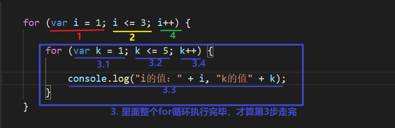

## js基础第02天

> 目标
>
> 1.理解逻辑运算符的使用
>
> 2.能使用if结构实现判断
>
> 3.能使用switch结构实现判断
>
> 4.能使用while循环实现代码重复执行
>
> 5.能使用for循环实现代码重复执行


## 操作符

### 补充算术操作符

#### ++   自增运算符

语法：

~~~js
 数据++;
 ++数据; 

var a = 10;
a++;  //  或者  ++a;
console.log(a);  //11   相当于 a = a + 1的结果，实现数据自增1
~~~

+ 数据++

+ ++数据

  相同点： 

  ​	 这两种写法，本身的计算结果是一样

  不同点： 

  ​      在运算中

  ​      数据++ 先拿数据原本的值进行计算，计算完后，再自增

  ​      ++数据 先自增，自增的结果来参与计算

#### -- 自减运算符

~~~js
数据--;
--数据
~~~


### 赋值操作符

~~~js
  赋值运算符  =
  执行过程：
	 先执行 = 右边的代码，得到结果，再给 = 的左边

  var num = 30;
  // num = num + 20;
  // 简写方式
  num += 20;
  console.log(num); // 50

~~~


### 逻辑操作符

逻辑运算符的主要作用是连接多个条件，我们要掌握的比较运算符有

```javascript
&&  ||  ！
```

`&&` 用在需要多个条件同时成立的时候

```javascript
// 用户在登录的时候要用户名和密码同时正确才能登录
var userName = prompt('请输入用户名');
var password = prompt('请输出密码');
console.log(userName === 'admin' && password === '123456');
// 只有 && 两边的 结果都是 true ，最终结果才是 true
```

`||` 用在只需要任意条件成立的时候

```javascript
// 只要年龄小5岁或者身高小于120cm就可以免费乘坐
var age = parseInt(prompt('请输入你的年龄'));
var height = parseFloat(prompt('请输入你的身高'));
console.log(age < 5 || height < 120);
// 只要 || 两边的结果有一个是true，最终结果就是true
```

`!` 用于颠倒是非的时候

```javascript
var res = true;
console.log(!res);
// 这里暂时用不到，在后面做具体效果的时候都用，那个时候我们再学习具体的使用
```

### 操作符的优先级

观察代码

```javascript
var res = 5 + 2 * 3;
console.log(res); // 11
```

在上述代码中，执行过程是先计算 `2*3` 再和 5 相加的。在js中的操作符很多，我们要认识到它们之间是有计算的优先顺序的，这个优先顺序我们称为`优先级`

记忆一下下面的计算优先级

```javascript
1. 第一优先级： [] . ()
2. 第二优先级： ++ -- !
3. 第三优先级： *  /  %
4. 第四优先级： +  -
5. 第五优先级： >   >=   <   <=
6. 第六优先级： ==   !=    ===    !==  
7. 第七优先级： &&
8. 第八优先级： || 
9. 第九优先级： = += -= *= /= %=  
```

上面是具体的优先级，但是平时我们不会把很多的操作符放在一起运算，所以我们大致记住

> 1. 括号先算
> 2. 其次算算术
> 3. 再次算比较
> 4. 然后算逻辑
> 5. 最后算赋值

使用多了，熟练了，规则就记住了


## 流程控制

js里面的代码是有执行顺序的，通过一些特殊的方式控制那些代码如何执行 —— 流程控制

**顺序结构**

按照从上到下的顺序，一行不漏的执行

**分支结构**

在逻辑上有多个分支，只会选择一个分支执行

**循环结构**

重复的代码，可以使用循环的方式实现多次

**表达式**

可以得到一个结果的代码 ，比如：

```js
// 下面都可以称为表达式
12; // 结果是12
a++; // 结果是 11
5 > 6; // 结果是 false
// ...
```

**语句**

语句可以理解为一个行为，一般在行为和行为之间，都会使用 `;` 隔开

```javascript
console.log(12); // 行为就是输出了一个12在控制台
alert('helloworld');　// 行为就是弹出了个提示框
var a = 10;
```

简而言之：一个`程序`可以由多个`语句`组成，一个`语句`可以由多个`表达式`组成


## 分支结构

从多个分支里面选择一个 —— 作用 ： 判断

判断一下一个人的性别，如果是男的，让他上男厕


### if结构

只有一个条件的判断

```js
if( 条件表达式 ){
   条件表达式的结果是true的时候要执行的代码
}

var gender = prompt('请问您的性别是男的吗');

if( gender === '男' ){
  alert('男厕所在二楼的最东边，请去吧');
}
```


两个条件的判断

```js
if( 条件表达式 ){
   条件表达式的结果是true的时候要执行的代码
}else {
  条件表达式的结果是false的时候要执行的代码
}

var gender = prompt('请告诉我你的性别');
if(gender === '男'){
  alert('男厕所在二楼的最东边，请去吧');
}else {
  alert('女厕所在3楼的西边');
}
```


多个条件的判断

```js
if( 条件表达式1 ){
   条件表达式1的结果是true的时候要执行的代码
}else if(条件表达式2){
  条件表达式2的结果是true的时候要执行的代码
}else if(){
         
}
// 如果还有更多的判断，继续写 else if ()

else {
  以上的条件都不为true，就会执行这里的代码
}


var gender = prompt('请告诉我您的性别');
// 男的上二楼
if(gender === '男'){
  alert('上二楼');
}else if(gender === '女'){
  // 如果是女的，上3楼
  alert('上三楼');
}else if(gender === '人妖'){
  alert('滚');
} else {
  alert('我没有听明白您的意思');
}
```

### 练习

1. 任意输入两个数,求两个数最大值,在弹窗中显示最大值(练习if-else结构)

2. 判断分数区间，分数在90到100的为A，80到89的为B，70到79的为C， 60到69为D，60以下为E (练习if-else-if 结构)

   ~~~js
    // 注意： 数学中 3 < x < 10 的写法在js中不存在，  要改成  3 < x  && x < 10
    var x = 11;
    console.log(3 < x < 10); // true
    console.log(3 < x && x < 10); // false
   ~~~

   

### switch结构

在js里面如果是比较固定值，推荐使用swtich-case结构

语法：

~~~js
switch (变量){
  case 要比较的固定的值1:
    变量和 固定的值1  ===   的时候要执行的代码
    break;
  case 要比较的固定的值2:
    变量和 固定的值2  ===   的时候要执行的代码
    break;
  case 要比较的固定的值3:
    变量和 固定的值3  ===   的时候要执行的代码
    break;
  default:
    当以上所有的条件都不成立的时候，代码在这里执行
    break;
}
~~~

举例

```js

switch (gender) {
  case '男':
    alert('去二楼');
    break;
  case '女':
    alert('去三楼');
    break;
  case '人妖':
    alert('滚');
    break;
  default:
    alert('人家没听懂');
    break;
}
```

**细节**：

1.default不是必须的

2.break的作用是结束判断，如果不想要，也可以不写

3.变量和固定值的比较是 === 严格等于

### 三元表达式(补充)

三元表达式的使用是简写if-else结构

语法

```javascript
表达式1 ? 表达式2 : 表达式3
// 如果表达式1 成立， 那么就执行表达式2
// 如果表达式1 不成立， 那么就执行表达式3
//例如： 求二个数字中谁更大
var a = 10; var b = 20;
var max = a > b ? a : b;
console.log(max);
```

### 总结

if结构，多用于判断区间、不定值判断

switch-case 只能用于定值判断


## 循环结构

在js中，如果我们要连续输出同样的一句话多次，会比较麻烦

```javascript
//输出　ｘｘｘ，不愧是你！！　６　次
console.log('不愧是你！！');
console.log('不愧是你！！');
console.log('不愧是你！！');
console.log('不愧是你！！');
console.log('不愧是你！！');
console.log('不愧是你！！');

```

同样的代码我们写了6次，这样是不好的，重复多次时，我们使用**循环结构**结构

### for循环

#### 固定用法

```js
for(初始化表达式 ; 条件表达式 ; 递增或者递减表达式){
  循环体（需要重复执行的代码）
}

for(var count = 0;count < 6; count++){
  console.log('javascript天下无敌！！！');
}
```


#### 执行过程

   1.先执行初始化表达式

   2.判断条件是否成立

   3.如果成立，执行循环体

   4.执行递增表达式

   重复2~4，直到第2步的条件为false，就结束循环

#### 练习

1. 求1~10之间的所有整数和


#### 嵌套for循环

~~~js
for(var i=1; i<=3; i++){
    for(var k=1; k<=5; k++){
        console.log("i的值："+i, "k的值"+k);
    }
}
~~~

执行过程




##### 练习：   

在浏览器中用*打印一个矩形形

~~~js
****
****
****
****
~~~


### while循环

#### 固定语法

```js
while( 条件表达式 ){
  当表达式的结果是true的时候，这里面的代码会重复的执行，直到条件为false
  循环体（需要重复执行的代码）
}

while(count < 10){
  console.log('javascript天下第一！！！');
}
```

#### 执行过程：

 1.先判断条件是否成立

 2.如果成立，会执行循环体

 3.当循环体执行完毕，会再次判断条件

 重复1~3多次，直到条件为false为止

#### 练习

不断要求用户输入学生姓名,输入q结束.


### do-while循环

#### 固定写法

```js
do {
  循环体（需要重复执行的代码）
}while (条件)
```

#### 执行过程

   1.先执行循环体1次

   2.判断条件

   3.如果是true，就执行循环体

   4.重复2~3多次，直到条件是false


## 总结

1. while、do-while 循环不易看出循环的次数，一般用于未知次数的循环
2. for循环明显看出循环的次数，一般用于已知次数的循环
3. while、for循环可能一次循环都不执行， do-while循环至少执行一次


## 作业

### 基本练习

~~~
1. 写出变量num1 和  num2的值在参与运算中 的变化， 以及sum最后的结果
var num1 = 10;
var num2 = 5;
var sum  =  num1++ + ++num1 + --num2
sum ?    
num1?
num2?

2. var num = 10;
	num = num + 20;    把这句代码写成简写模式

3. &&   与  ||  和 ！分别表示什么意思
4. 写出一个条件判断的if语句
5. 写出两个结果的语句（if-else）
6. 写出四个条件判断的if语句
7. 输入1就弹出‘星期一’，输入2，就弹出‘星期二’，。。。输入7就弹出‘星期日’（使用switch case实现）
8. 连续输出5次‘我待代码如初恋’, 使用for实现，写出代码的执行顺序
9. 求两个数的最大值，用if实现
10. 求两个数的最大值，用三元表达式实现
~~~


### 判断语句练习

    1. 让用户输入用户名和密码,如果用户名为admin,密码为123456,则提示登录成功.
    2. 小红买了一筐鸡蛋，如果坏鸡蛋少于5个，他就吃掉，否则他就去退货。
    3. 提示用户输入年龄，如果大于等于18，则告知用户可以查看，如果小于10岁，则告知不允许查看，如果大于等于10岁并且小于18，
       则提示用户是否继续查看（yes、no），如果输入的是yes则提示用户请查看，否则提示"退出,你放弃查看"。	

### 循环语句练习

1. 求1到10之间所有数的和

2. 求1-100之间所有偶数的和

   思路：

~~~js
// 1. 设置一个变量，用来做数据的累加初始值
// 2. 先拿到1 到 100之间的所有数字（for循环）
// 3. 过滤出偶数， 如果满足 i %2 == 0, 这个条件成立，则证明这个i是偶数
// 4. 把偶数进行累加
~~~

3. 求1-100之间所有所有奇数的和
4. 本金10000元存入银行，年利率是千分之三，每过1年，将本金和利息相加作为新的本金。计算5年后，获得的本金是多少？

5. 在页面中打印出一个直角三角形

~~~html
*
**
***
****
*****
~~~


