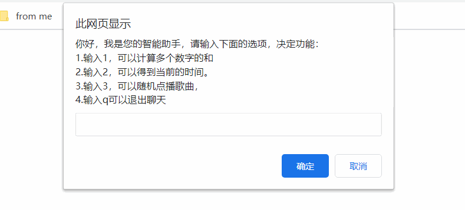

# js基础第03天

> 目标
>
> 1.嵌套for循环
>
> 2.能使用break结束循环
>
> 3.能使用数组存储数据
>
> 4.能获取数组中存储的数据
>
> 5.能使用for循环遍历数组


## 一、循环的结束语句

某些情况下，我们不一定要循环从头到尾执行，这个时候就要使用break和continue控制循环的次数

### break

作用：

1.阻止switch-case结构的继续判断

2.阻止循环的继续执行，然后break之后的代码就不会执行了


需求：在循环打印1到5的过程中，打印到3就停下来，不打印了，后面的4，和5也不打印了。


### continue

作用

跳过当前这一次循环，继续执行下一次循环

需求：在循环打印1到5的过程中，打印到3就停下来，但是后面的4和5还会打印。

总结：

1. break用于结束整个循环
2. continue用于结束整个循环中的一次
3. break和continue后面的代码都不会执行


### 小结

> 1.当我们需要多次执行同样的代码的时候，就可以使用循环来实现
>
> 2.while、do-while可以用于未知次数循环的
>
> 3.for可以用于已知次数循环的，也是我们程序里面最常用的
>
> 4.终止整个循环，使用break,跳过一次循环，使用continue

### 练习

1. 不断要求用户输入学生姓名,输入q结束.

2. 要求用户输入用户名和密码，只要不是admin、888888就一直提示用户名或密码错误,请重新输入。

   

## 二、数组

数组是一个有顺序、有长度的数据集合

### 2.1、定义数组

```javascript
// 5个人的成绩为： 91，88，72，45，63
// 先定义一个数组
var arr = [];
console.log(arr); // 输出 []  这是一个没有数据在里面的数组，称为空数组
```

### 2.2、数组存值

数组中的数据使用索引管理。索引就是序号，只不过数组中的数据从0开始

```javascript
//把成绩存储到数组中
arr[0] = 91;
arr[1] = 88;
arr[2] = 72;
arr[3] = 45;
arr[4] = 63;
console.log(arr); // 输出 [91,88,72,45,63] 就是一个数据集合
```

但是这个方式是比较麻烦的，我们如果一开始就知道数组了，可以直接使用一个简单的语法存储数据

```javascript
var arr = [91,88,72,45,63];
console.log(arr); // 输出的结果是一样的
```

> tips : 两个方式自己可以灵活使用


### 2.3、数组取值（数组索引）

把数据存储在数组里面，是为了将来能使用的，所以要从里面把数据取出来。数据取值同样使用索引取。

```javascript
console.log(arr[0]);
var sum = arr[0] + arr[1] + arr[2] + arr[3] + arr[4];
console.log(sum); // 输出370
```

> 把 `数组[索引]`格式当成一个变量使用就行

### 2.4、遍历数组

我们在求成绩总和的时候，一个一个地把数组里面的数组取出来了，从索引 0 到最后一个索引，里面有很多重复的代码，我们其实可以使用循环实现。

```javascript
// 最初的写法
var sum = arr[0] + arr[1] + arr[2] + arr[3] + arr[4];
```

转化一下

```javascript
var sum = 0;
sum += arr[0];
sum += arr[1];
sum += arr[2];
sum += arr[3];
sum += arr[4];
```

再转化

```javascript
var sum = 0;
var i = 0;
sum += arr[i];
i++;
sum += [i];
i++;
// 直到i == 4 结束
```

写成循环

```javascript
var sum = 0;
for(var i = 0; i <= 4; i++){
  sum += arr[i];
}
console.log(sum); // 输出 370，和我们一个一个相加是一样的
```

使用循环来遍历数组，当数组中的数据比较多的时候，会比较方便。


### 2.4、数组长度

我们在遍历数组的时候，发现总是从索引 0 开始遍历，到最后一个索引，但是如果数据比较多的时候，我们就不容易得到最后一个索引是多少。所以在这还有一个更简单的写法：使用数组的长度来控制遍历的次数。

数组长度：就是数组中数据的个数

```javascript
console.log(arr.length); // 数组.length 就是数组的长度
```

如果数组的长度是5，索引的最后一个就是4，我们发现最大索引总是比长度少 1 ，所以遍历还可以这么写

```javascript
for(var i = 0; i <= arr.lensgth - 1; i++){
  console.log(arr[i]);
}
// 简化一下
// 把 <= 的 = 号 去掉，会使循环的次数少一次，我们把上限次数+1，就变成了  i < arr.length - 1 + 1 ,最终：
for(var i = 0; i < arr.lensgth; i++){
  console.log(arr[i]);
}
```


### 2.5、案例--机器人功能



## String

在小娜的功能1中，我们要从一个"数字,数字,数字"的格式中获取这些数字，就要把字符串以逗号为分隔符，分割这个字符串

js中提供了一个分割字符串的方法

字符串.split(指定分隔符)

```javascript
var str = '12,88,72,6';
// 以逗号为分隔符，分割字符串，得到一个数组
var arr = str.split(',');
console.log(arr); // 输出 ['12','88','72','6']
```

这个方法分割字符串后，会以一个数组的方式把所有的数字给我们


## Date

在机器人的功能2中，需要获取当前的日期和时间。

在js中，要获取系统的当前日期和时间，需要用到一个js自带的Date对象(现在先不管什么是对象，先学习如何使用)

### 创建Date对象

```javascript
var date = new Date();
console.log(data); // 系统时间不同，输出的结果也会不同，但是都是输出当前系统的时间
```

### 获取时间的各个部分

```javascript
var date = new Date();
// 获取年份
var year = date.getFullYear();
console.log(year);
// 获取月份 ， 得到的月份是从0开始的 ，使用 0-11 表示 1-12 月
var month = date.getMonth();
console.log(month);
// 获取天
var day = date.getDate();
console.log(day);
// 获取小时
var hour = date.getHours();
console.log(hour);
// 获取分钟
var minute = date.getMinutes();
console.log(minute);
// 获取秒数
var second = date.getSeconds();
console.log(second);
```


## Math

在js中也提供了获取随机数和取整的功能

### 获取随机数

```javascript
// 获取随机数
var r = Math.random();
console.log(r); // 输出一个在 [0,1) 之间的浮点数，可以得到0，但是无法得到1
```

如果想要得到一个随机整数，需要把整机浮点数  乘以 一个 倍数 再取整

```javascript
// 获取 [0,10) 之间的随机浮点数
var r = Math.random() * 10;
```

### 对浮点数取整

在js中，可以使用  Math.floor() 这个方法对浮点数取整，这个方法取整的方式是向下取整

**向下取整**： 将一个浮点数，向数轴的左边获取最近的一个整数

### 获取一个随机整数

```javascript
// 获取一个 [0,10] 之间的随机整数
var r = Math.random();
r = r * (10 + 1) ;// 因为 Math.random得到的是不能得到1的浮点数，我们等下要向下取整，就得不到10了， * 11 向下取整才能得到10
r = Math.floor(r);
console.log(r); // 得到一个在 [0,10] 之间的整数
```


> 回顾
>
> 1.JavaScript中内置了很多的功能，使用这些功能，我们可以快速实现很多效果，这些内置的功能，我们称为内置对象
>
> 2.Date用于获取和日期相关的数据，Math用于实现和计算相关的功能，String用于快速实现和字符串相关的功能


## 作业练习

1. 求一个数组中所有数字的总和和平均值

2. 求数组中所有数字的最大值
3. 求数组中最大值的索引


> 回顾
>
> 1.如果要存储多个数据，就使用数组来存储
>
> 2.在数组里面使用索引访问每个数据
>
> 3.基于数组的顺序和长度，我们可以使用for循环遍历数组


