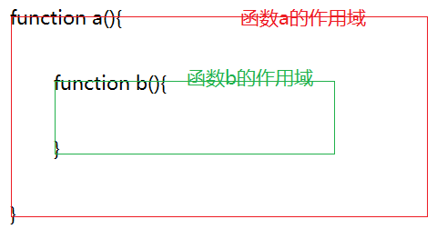

# js基础第04天

> 今天的目标
>
> 1.能说出函数的作用
>
> 2.能使用function关键字定义函数
>
> 3.能使用函数的参数
>
> 4.能使用return关键字修改函数的返回值
>
> 5.能区分全局使用域和局部作用域
>
> 6.能说出预解析的过程


## 一、函数

### 1.1、什么是函数

函数就是一段可以重复执行的代码段。

我们把一段相对独立的具有特定功能的代码块封装起来，形成一个独立实体，起个名字（函数名），在后续开发中可以反复调用。

函数的作用就是封装一段代码，将来可以重复使用。


固定语法：

### 2.1、定义函数

```js
function 函数名(){
  函数体 - 需要重复时候用的代码
}

function tellStory() {
  console.log('从前有座山，山上有座庙');
  console.log('庙里有个老和尚和一个小和尚');
  console.log('老和尚正在给小和尚讲故事');
  console.log('讲的什么呢？');
}
```

注意点： 函数里面的代码是不会执行的，需要调用才会执行


### 2.2、函数的调用

然而我们写出上面函数的代码之后，在浏览器中打开页面，却没有任务内容被输出。这是因为函数在定义的时候，里面的代码是不会执行的，只有调用了函数，函数中的代码才会执行。

调用函数的语法

```javascript
函数名();
```

如：

```javascript
tellStroy(); //此时在控制台中就会输出一个故事
```

如果想输出多次，就可以调用多次这个函数

```javascript
tellStroy(); 
tellStroy(); 
tellStroy(); 
```

每调用一次，就会执行一次，做了代码的重复使用。

> tips : 一定要记住，函数定义时是不会执行的，只有调用时才会执行。可以使用代码调试工具进行代码执行过程观察。


### 2.3、函数的参数

我们希望在调用函数的时候，可以知道小和尚的名字是什么，而且每次可以给不同的小和尚讲故事。也就是说我们重复使用的过程里面有会变化的东西，我们使用`参数`解决

语法

```javascript
function 函数名(参数){
  函数体
}
```

如：

```javascript
function tellStroy(name){
  console.log("从前有座山，山里有座庙");
  console.log("庙里有个老和尚在给小和尚讲故事");
  console.log("讲的是什么呢？");
  console.log("老和尚对"+ name +"说：");
}
```

就是说参数就好像函数里面的一个变量一样，可以存储一个随时变量的数据

当我们调用函数的时候，再给一个真实的值

```javascript
tellStroy('清风');
tellStroy('明月');
```

如果我们想在调用函数的时候，把老和尚的名字也明确一下，也是可以的

```javascript
function tellStroy(name1,name2){
  console.log("从前有座山，山里有座庙");
  console.log("庙里有个老和尚在给小和尚讲故事");
  console.log("讲的是什么呢？");
  console.log(name1 "对"+ name2 +"说：");
}
```

要调用的时候：

```javascript
tellStroy('圆通','清风');
```

> tips: 函数的参数可以一个，也可以是多个，只要在重复的过程中，有多个会产生变化的数据，都可以使用参数的方式解决
>
> 在定义函数时写的占位用的参数，我们称为**形参**，在调用函数，实际参与函数执行的参数，我们称为**实参**


### 2.4、函数的返回值

函数执行完毕之后会有一个执行结果，该结果就叫 —— 返回值

如果你希望函数执行完毕之后，有一个你想要的数据，就可以使用返回值来实现

函数默认情况下，得到的结果是 —— undefined

想要修改可以修改，使用return修改

```js
function 函数名(参数){
  
  return 想要的数据
}
```


## 二、练习

1. 求1-n之间所有数的和

2. 求n-m之间所有数的和( 先写一个求10到100之间的累加和)

3. 圆的面积(圆的面积公式： 圆周率 * 半径的平方 )

   传入一个任意的半径,可以得到圆的面积
   
   

## 三、书写函数的步骤

1. 写出要实现的过程
2. 分析过程中哪些是会变化的，哪些是不会变化的
3. 把变化的作为参数，不变的作为函数体
4. 按照函数的语法把代码写来
5. 考虑是否需要修改函数的返回值


## 四、补充函数

函数的声明还可以使用 ： 

### 4.1、函数表达式

```js
var 函数名 = function(参数){
  函数体
}

var getSum = function(a,b){
  return a + b;
}
```


### 4.2、匿名函数

没有名字的函数

```js
function (参数){ 函数体 }
```


### 4.3、自调用函数

```js
(function({
  	// 写一些为了避免变量污染的代码
}))();
```


## 五、全局和局部作用域

函数和变量的有效范围就是作用域

### 5.1、作用域

```javascript
var a = 10;
function f1(){
  console.log(a);
}
f1();// 变量a在函数外定义，可以在函数内使用

function f2(){
  var b = 20;
}
console.log(b); // 变量b在函数内定义，在函数外无法访问，报错： b is not defined
```

这是因为js中存在作用域的概念。

作用域：

作用域就是指定一个变量或者一个函数的作用范围。

能在页面的任何位置都可以访问，称为 **全局作用域**

只能在函数内访问，称为为  **局部作用域**

在全局作用域下声明的变量，称为 **全局变量**

在局部作用域下声明的变量，称为 **局部变量**

上述代码中，a是全局变量，b是局部变量


### 5.2、全局

script标签或者是一个js文件内部直接定义的

在全局下定义的变量在任何位置都可以使用，称为全局变量

```html
<script>
var a = 10; // 这个就是可以在任何地方访问的
</script>
```


### 5.3、局部

函数内部就是局部作用域

```js
function fn(){
  var b = 10; // b就是局部变量
}
```

局部作用域里面的数据，外面是访问不了的。

作用域的作用就是为了把数据进行保护，不让外部的数据对我们的数据进行污染


### 5.4、作用域链

在JavaScript里面，函数内部是可以包含另一个函数的

```javascript
function a(){  
  function b(){
    
  }  
}
```

此时函数b就被函数a包含越来了，这样就形成了两层作用域。



如果有以下代码

```js
var x = 10;
console.log(x);
function a(){
  var x = 20;
  console.log(x);
  function b(){
    var x = 30;
    console.log(x);
  }
  b();
}
a();
```

会依次输出：10，20，30

虽然多个变量x同名，但是不同作用域内优先使用自己内部作用域的变量x。

如果代码做一下修改

```js
var x = 10;
console.log(x);
function a(){
  var x = 20;
  console.log(x);
  function b(){
    console.log(x);
  }
  b();
}
a();
```

依次输出10,20,20

函数b内部没有变量b，会向自己的外面的作用域查找x变量，函数a内的x变量离函数b最近，会优先得到函数a的变量x

代码再做修改

```js
var x = 10;
console.log(x);
function a(){
  // 函数a内部的变量x也没有了
  console.log(x);
  function b(){
    // 函数b内部没有x变量了
    console.log(x);
  }
  b();
}
a();
```

会依次输出10,10,10

函数b内部没有x变量，会向函数a的作用域查找，但是函数a内部也没有x变量，会向函数a的上一层作用域再查找，直到查找到了全局作用域。

代码再次变化

```js
// 全局的变量x也没有了
function a(){
  // 函数a内部的变量x也没有了 
  function b(){
    // 函数b内部没有x变量了
    console.log(x);
  }
  b();
}
a();
```

函数b内部没有变量x，会顺着上层作用域一层一层地查找，直到全局作用域也没有，就会报错。

> 总得来说：
>
> 如果程序中存在多级作用域，就形成了一个作用域链(作用域的一层一层关系)
>
> 其上有变量的访问规则
>
> 1.如果内部有这个变量，优先使用这个自己内部的变量
>
> 2.如果自己内部没有这个变量，则会上层作用域查找，从最近的作用域中获取变量
>
> 3.如果查找到了全局作用域也没有这个变量，则报错

**作用域链：变量的查找规则**

### 5.5、预解析

```javascript
fn();// 正常执行
function f1(){
  console.log(1);
}
fn(); // 正常执行

f2();// 报错 ： f2 is not a function
var f2 = function(){
  console.log(2);
}
// function 关键字定义的函数，可以在定义之前使用，函数表达式的不行
```

因为在js中，代码执行之前，会先进行一次**预解析**

预解析就是在执行代码之前，把代码中的变量声明和函数声明，提升到当前作用域的最顶端，而变量的赋值和函数的调用还在原来的位置。

上面的代码预解析后：

```javascript
function f1(){
  console.log(1);
}
var f2;
fn();
fn(); 
f2();
f2 = function(){
  console.log(2);
}
```

所以在调用f1的时候，其实函数已经声明好了，但是在调用f2的时候，f2还是undefined，就会报错

## 六、作业练习

```javascript
// 观察下面的代码，说出执行结果
//1. 
var num = 10;
fun();
function fun() {
  console.log(num); 
  var num = 20;
}

// 案例2
        var num = 10;

        function fn() {
            console.log(num);
            var num = 20;
            console.log(num);
        }
        fn();

// 案例3
        var a = 18;
        f1();

        function f1() {
            var b = 9;
            console.log(a);
            console.log(b);
            var a = '123';
        }

// 案例4
        f1();
        console.log(c); 
        console.log(b); 
        console.log(a); 

        function f1() {
            var a = b = c = 9;
            console.log(a); 
            console.log(b);
            console.log(c);
        }
```


> 回顾
>
> 1.函数在JavaScript中是一种非常重要的角色
>
> 2.当我们需要把代码重复使用的时候，可以使用函数把要重复使用的代码包起来
>
> 3.封装函数就是找到过程中会变化的作为参数，把不变的作为函数体
>
> 4.封装好的代码只会在调用函数的时候执行
>
> 5.函数可以形成一个作用域，里面的数据在外面是不能访问的
>
> 6.函数的变量会在预解析的时候提升


​	


